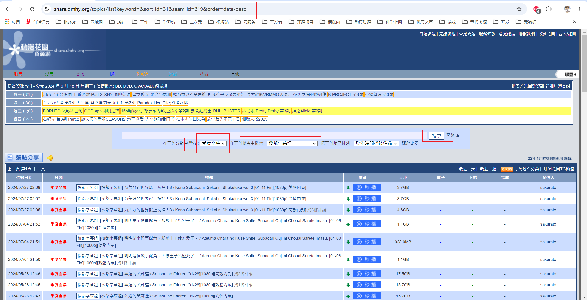
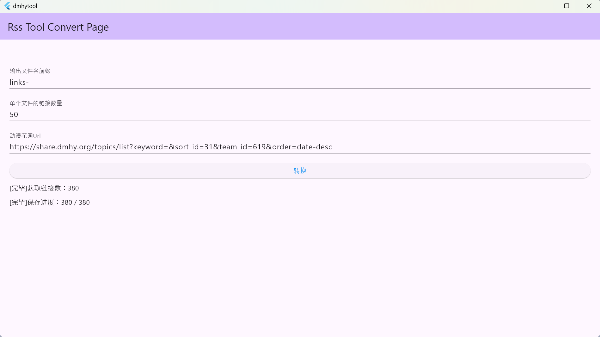

# dmhy tool

Windows平台的小工具，用于批量提取动漫花园的磁力链接，方便直接复制到比如115网盘进行云下载。

# 用法

首先进动漫花园网站(https://share.dmhy.org/)

展开`高级`，选中`分类`为`季度全集`，选中你中意的字幕组，点击`搜寻`按钮查询

复制浏览器的链接到应用的输入框，点击下方按钮导入，耐心等待下方完成

最后生成的txt文件路径在你的文档目录下的`run.ikaros.ch.dmhytool`目录里。

# 视频

<https://www.bilibili.com/video/BV1vFt3eDEfh/>

